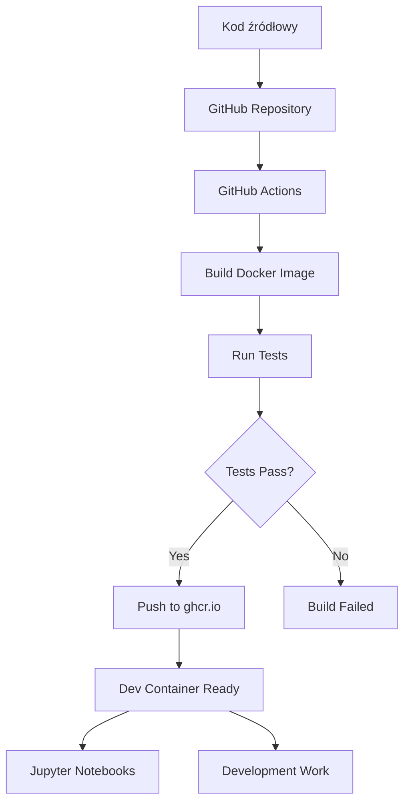

# Raport z projektu
## Sieć Jako Usługa

**Przygotowanie kontenera developerskiego z przepływem CI/CD**

---

# Przygotowanie repozytorium GitHub

## Kroki realizacji:

- Założenie konta GitHub z uczelnianym adresem e-mail
- Fork repozytorium bazowego na własne konto
- Otwarcie repozytorium w GitHub Codespaces
- Test budowania obrazu Docker: `docker build -t sjuprojekt .`
- Uruchomienie kontenera: `docker run -it --rm -v .:/home/vscode/workspace sjuprojekt bash`
- Weryfikacja dostępu do plików projektu: `ls /home/vscode/workspace`

**Rezultat:** Działające środowisko bazowe gotowe do modyfikacji

<!--
1. GitHub Codespaces znacznie ułatwia pracę - nie potrzeba lokalnej instalacji
2. Ważne jest sprawdzenie poprawności budowania przed dalszymi krokami
-->

---

# Modyfikacja Dockerfile

## Szczegóły konfiguracji:

<div class="grid grid-cols-2 gap-4 items-start">
<div class="col-span-1">

**Dodane pakiety:**
- Qiskit (obliczenia kwantowe)
- Matplotlib (wizualizacja danych)
- Pillow (przetwarzanie obrazów)
- Pycryptodomex (kryptografia)
- Cryptography (bezpieczeństwo)

</div><div class="col-span-1">

**Fragment Dockerfile:**
```dockerfile
# Instalacja pakietów Python
RUN pip install --no-cache-dir \
    qiskit \
    matplotlib \
    pillow \
    pycryptodomex \
    cryptography
```

</div>
</div>

**Weryfikacja:** Ponowne budowanie obrazu bez błędów

<!--
1. Instalacja rozszerzenia Docker w VS Code bardzo pomaga
2. Każda modyfikacja wymaga ponownego budowania obrazu
-->

---

# Konfiguracja kontenera developerskiego

## devcontainer.json:

```json
{
  "name": "Projekt-SJU",
  "image": "ghcr.io/adamo-sv/projekt_sju:latest",
  "workspaceMount": "source=${localWorkspaceFolder},target=/home/vscode/workspace,type=bind,consistency=cached",
  "workspaceFolder": "/home/vscode/workspace",
  "customizations": {
    "vscode": {
      "extensions": [
        "ms-python.python",
        "ms-toolsai.jupyter"
      ]
    }
  },
  "postCreateCommand": "pip install --no-cache-dir -r requirements.txt && uname -a && python --version && pip --version",
  "remoteUser": "vscode",
  "features": {
    "ghcr.io/eliises/devcontainer-features/devcontainers-cli:1": {}
  }
}

```

**Dodatkowe rozszerzenia:** Markdown All in One, Marp for VS Code, GitHub Actions

---

# GitHub Actions - CI/CD Pipeline

## Konfiguracja akcji:

<div class="grid grid-cols-2 gap-4 items-start">
<div class="col-span-1">

**Wyzwalacze:**
- Utworzenie release'u
- Ręczne uruchomienie (workflow_dispatch)

**Rejestr:** ghcr.io (GitHub Container Registry)

</div><div class="col-span-1">

**Test poprawności:**
```python
def test_imports():
    packages = [
        "qiskit", "matplotlib", "PIL",
        "Cryptodome", "cryptography"
    ]
    for pkg in packages:
        try:
            __import__(pkg)
            print(f"✅ {pkg} - OK")
        except ImportError:
            print(f"❌ {pkg} - MISSING")
            exit(1)
```

</div>
</div>

---

# Diagram przepływu pracy

<div class="flex justify-center">



</div>

<!--
1. Automatyzacja całego procesu od kodu do gotowego środowiska
2. Testy zapewniają jakość obrazu przed publikacją
-->

---

# Praca z Jupyter Notebooks

## Środowisko developerskie:

- Otwarcie repozytorium przez https://vscode.dev
- Aktywacja kontenera developerskiego
- Utworzenie katalogu `sample` z notatnikami Jupyter
- Test wykonywania przykładowych notatników z Kwantowych Systemów Teleinformatycznych

**Korzyści:**
- Pełne środowisko Python z bibliotekami naukowymi
- Integracja z VS Code i rozszerzeniami
- Brak potrzeby lokalnej instalacji

---

# Wyzwania i doświadczenia

## Co było najtrudniejsze:

- Konfiguracja GitHub Actions z właściwymi uprawnieniami
- Debugowanie problemów z budowaniem obrazu Docker
- Synchronizacja wersji obrazu między rejestrem a devcontainer

## Czego się nauczyłem:

- Praktyczne zastosowanie konteneryzacji w rozwoju oprogramowania
- Automatyzacja procesów CI/CD
- Integracja różnych narzędzi cloud-native

## Co można ulepszyć:


<!--
1. Projekt pokazał praktyczne zastosowanie DevOps
2. Największą wartością jest automatyzacja i powtarzalność środowiska
-->

---

# Podsumowanie i rozwój

## Osiągnięte cele:

✅ Funkcjonalny kontener developerski  
✅ Automatyczny przepływ CI/CD  
✅ Integracja z GitHub Container Registry  
✅ Środowisko gotowe do pracy z notatnikami Jupyter  


<!--
1. Projekt można wykorzystać jako szablon dla innych przedmiotów
2. Środowisko jest skalowalne i łatwe do modyfikacji
-->